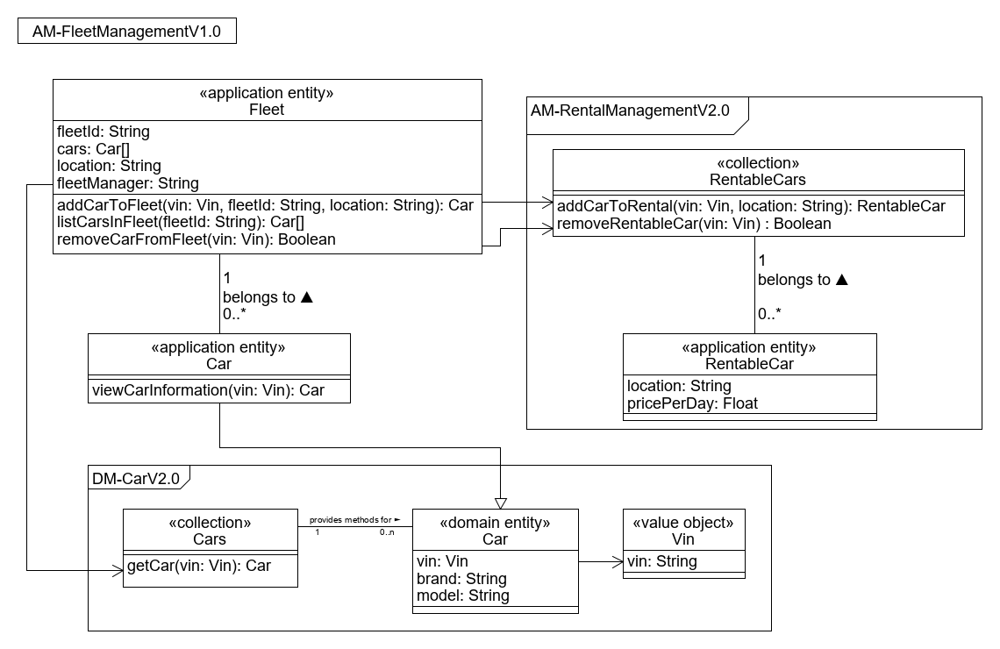

# API Diagram AM-FleetManagementV1.0

(«application entity» Fleet) The main application entity of the microservice. It includes a list of cars, a location, and is assigned to a fleet managed identified by a string.

(«application entity» Car) («domain entity» Car) The application entity Car inherits the attributes (i.e., vin, brand, model) of the domain entity Car.
