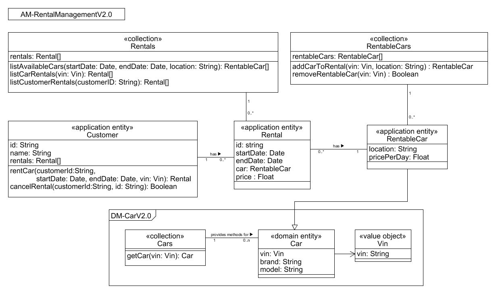

# API Diagram AM-RentalManagement V2.0

(«collection» Rentals) The collection manages all rentals in the system to provide list and view functions for rentals. 

(«application entity» Rental) The main entity of the microservice including a start date, end date, price, and a car where this rental has been performed.

(«application entity» Customer) The customer is an entity which can perform rentals in the system. Therefore every method in this entity is implicitely performed by it.

(«collection» RentableCars) Collection of all rentable cars in the system. It provides methods to add (CRUD) and remove (CRUD) rentable cars. 

(«application entity» RentableCar) This entity represents a car that exists in the system and can be rented. It inherits from Car and adds location and price per day information.
