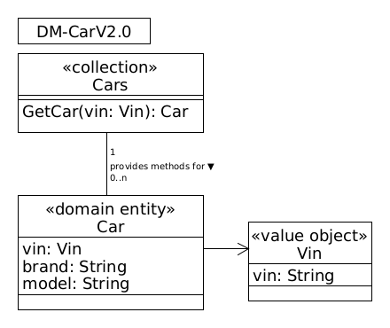

# API Diagram DM-CarV2.0

(«collection» Cars) This collection is needed to model the method GetCar (operation Read) applied on the domain entity Car.

(«entity» Car) The main entity of the DM-Car containing vin, brand, and model as attributes.

(«value object» VIN) The Vehicle Identification Number (VIN) is modeled as own value object.
