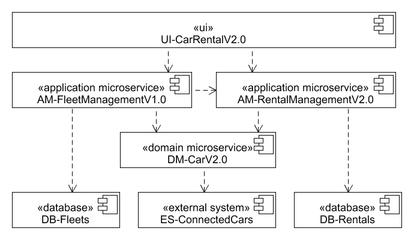

# Component Diagram CarRentalAppV2.0

(«user interface» UI-CarRentalV2.0) The user interacts with the UI-CarRentalAppV2.0 in order to rent cars and perform fleet management.

(«application microservice» AM-RentalManagementV2.0) The application logic provides the application-specific functionality in order to allow customers the rental of cars.  
(«application microservice» AM-FleetManagementV1.0) The application logic provides the application-specific functionality in order to allow cars in a location to be organized in a fleet and to allow a fleet manager to manage his fleet.  
(«domain microservice» DM-CarV2.0) DM-Car concerns the application agnostic functionality related to a car.

(«external system» ES-ConnectedCars) The external system where the car system retrieves its information about cars. It provides basic car information such as brand and model.  
(«database» DB-Fleets) («database» DB-Fleets) The fleet information is persisted in this database.  
(«database» DB-Rentals) («database» DB-Rentals) The rental information is persisted in this database.
