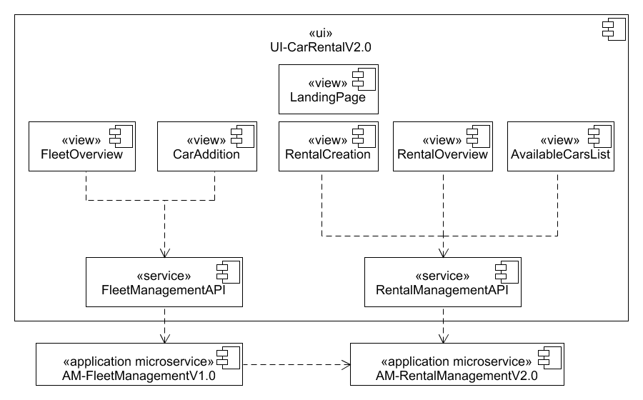

# Component Diagram UI-CarRentalV2.0

(«view» LandingPage) This view is shown to the users as the fist page.

(«view» FleetOverview) Lists all cars in the fleet with the ability to add and remove cars.  
(«view» CarAddition) Form fields for adding a new car.  
(«service» FleetManagementAPI) Provides an interface for using the application microservice AM-FleetManagement.  

(«view» RentalCreation) View bundles required fields for creating a new rental.  
(«view» RentalOverview) Lists all rentals of a user.  
(«view» AvailableCarsList) Lists cars available for rental.  
(«service» RentalManagementAPI) Provides an interface for using the application microservice AM-RentalManagement.  