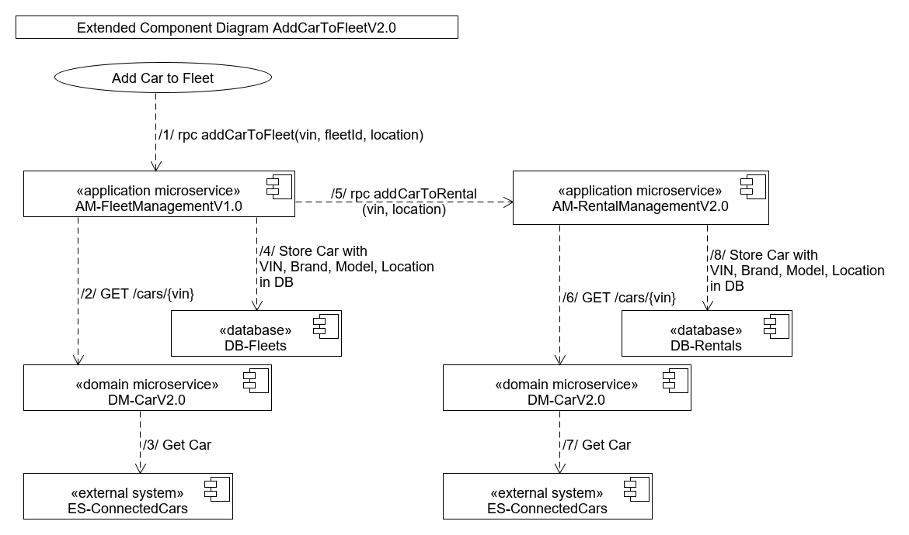

# Extended Component Diagram AddCarToFleetV2.0

(/1/ rpc addCarToFleet(vin, fleetId)) The fleet manager adds a new car to a fleet by providing a vin of the car and a fleet id of the fleet he owns and want to add the car. 

(/2/ GET /cars/{vin}) The car is validated by querying the basic car information from DM-CarV2.0

(/3/ Get Car) The car is fetched from the external system ES-ConnectedCars.

(/4/ Store Car with Vin, Model, Brand, Location in DB) The car is added to the database db-fleets.

(/5/ rpc addCarToRental(vin: Vin, location: String)) The car is added to AM-RentalManagementV2.0 where the vin is forwarded from the initial request while the location is the location of the fleet. 

(/6/ GET /cars/{vin}) The car is validated and basic car information is fetched. 

(/7/ Get Car) The car is fetched from the external system ES-ConnectedCars.

(/8/ Store Car with Vin, Model, Brand, Location in DB) The car is added to the database db-rentals.  