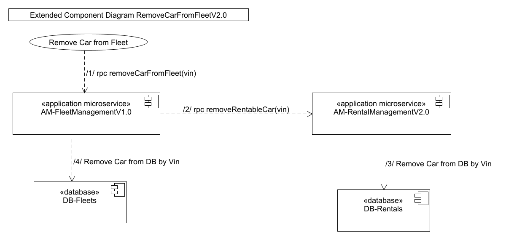

# Extended Component Diagram RemoveCarFromFleetV2.0

(/1/ rpc removeCarFromFleet(vin)) The fleet manager removes the car from a fleet. Since one car is assigned to at most one fleet, a vin uniquely identifies the car to be removed from the fleet.

(/2/ rpc removeRentableCar(vin)) The car identified by the vin is removed from the rentable cars. If a car still has rentals pending, this method fails.

(/3/ Remove Car from DB by Vin) The car is removed from db-rentals and is no longer rentable.

(/4/ Remove Car from DB by Vin) The car is removed from DB-Fleets.