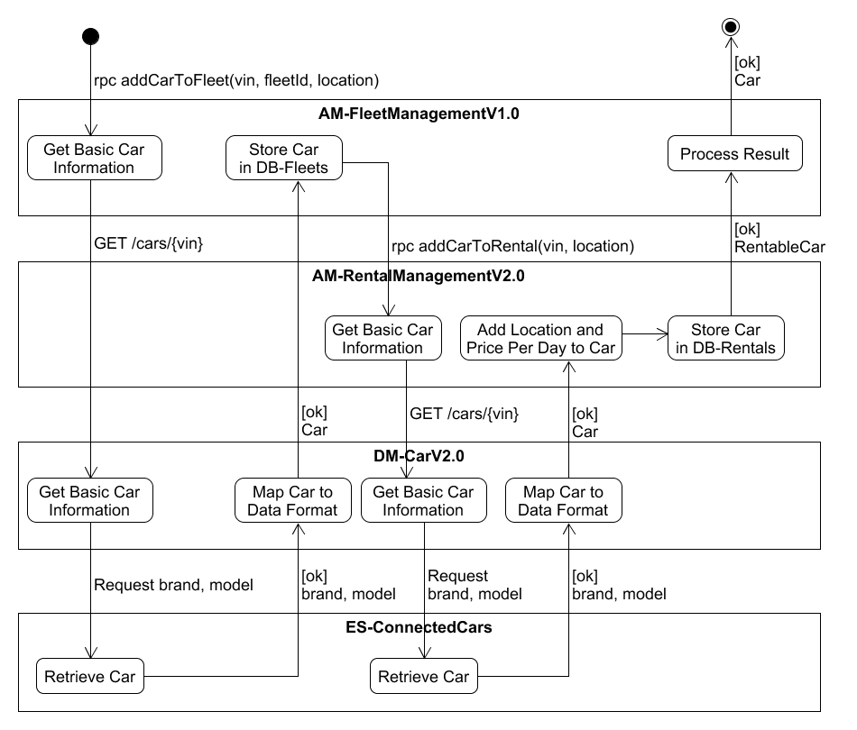

# Orchestration Diagram AddCarToFleetV2.0

Examples of operations and actions the orchestration diagram "Add Car to Fleet" V2.0 is built of:

(rpc addCarToFleet(vin, location) The car which is to be added to the fleet is identified by the VIN of the car whereas the fleet is identified by the location of the fleet.

(Get Basic Car Information) The basic car information consists of the model and the brand of the car.
(Retrieve Car) How the external system ES-ConnectedCars retrieves the brand and model of the cat identified by the VIN is an implementation detail.

(Store Car in DB-Fleets) The following car information is stored in DB-Fleets: vin, location (input parameters of the request), brand, model (received from DM-Car)

(rpc addCarToRental(vin, location) After the new car was successfully added to the fleet by AM-FleetManagementV1.0, it is made known to AM-RentalManagementV2.0 with this rpc function call. The basic car information brand and model are not foreseen as input parameters of the rpc function which means that AM-RentalManagementV2.0 must request them from DM-CarV2.0.

(Process Result) The following car information is returned: vin, location, brand, model

