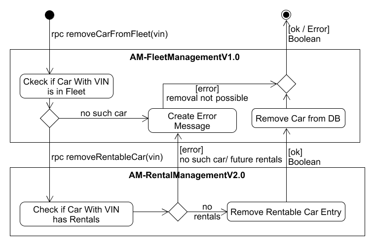

# Orchestration Diagram RemoveCarFromFleetV2.0

The activity flow modeled in the orchestration diagram is derived from the use case "Remove Car from Fleet" defined in the analysis phase. The fleet manager enters a fleet, vin. 

(rpc removeCarFromFleet(vin)) This rpc function removeCarFromFleet(vin) is responsible for removing the car in the AM-FleetManagmentV1.0 system.

(Check of Car With VIN is in Fleet) AM-FleetManagementV1.0 validates that a car exists for the given VIN. If true, it requests that AM-RentalMangementV2.0 removes the RentableCar entry for this car and removes the car from its database.

(rpc removeRentableCar(vin)) This rpc function is responsible for removing cars from AM-RentalManagment so that Customers no longer can rent that car.

(Check of Car With VIN has Rentals) AM-RentalMangagementV2.0 checks if the RentableCar has no rentals with a date in the future and that the car exists. 
(Remove Rentable Car Entry) If true it removes the car matching the VIN from RentableCars. 
([error] no such car/future rentals) If false, it responds with a matching error message. 

(Return Success) If the car was successfully removed from the fleet, a success message is returned.

(Create Error Message) If the car can not be removed, a matching error message is created. If the operations fails because of AM-RentalManagementV1.0, the remove operation on the own database is rolled back.

(Remove Car from DB) If there are no errors, the car is removed from the FleetManagementV1.0 database.
