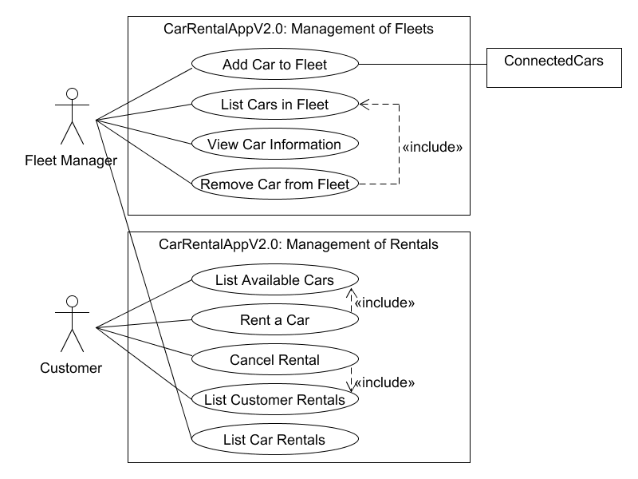

# Use Case Diagram

(List Available Cars) A customer can view the available cars in the rental interval indicated by the customer. He must select a location for filtering.

(Rent a Car) A customer rents a car if an approriate one is available in the rental interval indicated by the customer. The customer selects the car from the list provided by "List Available Cars".

(Cancel Rental) A customer cancels one of his existing future rentals. He selects a future rental from all his rentals for cars.

(List Customer's Rentals) A customer can list his rentals of cars.

(List Car Rentals) A fleet manager can list all rentals of a car belonging to his fleet.

(Add Car To Fleet) A fleet manager can add a new car to the system and to his fleet.

(List Cars in Fleet) A fleet manager can list all cars belonging to his fleet.

(View Car Information) A fleet manager can view the information of a car belonging to his fleet. He selects this car from the list of all cars belonging to his fleet.

(Remove Car from Fleet) A fleet manager can remove a car from his fleet if there are no more rentals for the car. He selects the car to remove from the list of all cars belonging to his fleet.
