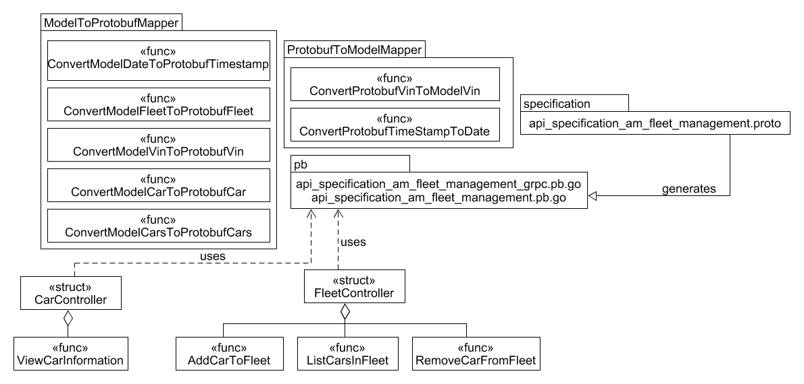

# Code Sketch API AM-FleetManagementV1.0

This figure shows how the api of AM-FleetmanagementV1.0 is organized.

(package ModelToProtobufMapper) This package has all the necessary helper methods to map model data types, which are used in our logic, to protobuf data types. These can then be used to be included in request structs for RPC calls.

(package ProtobufToModelMapper) This package has all the necessary helper methods to map protobuf data types, which are received from RPC calls to the API, to model data types.

(«struct» CarController) This struct controlls the CarService methods. Whenever the RPC call for a method belonging to the CarService comes in, the RPC server calls the functions inside this controller.

(«struct» FleetController) This struct controlls the FleetService methods. Whenever the RPC call for a method belonging to the FleetService comes in, the RPC server calls the functions inside this controller.

(directory specification) This is where the API specifications, which outline this API's structure, are stored.

(package pb) This is where the data types for each request and response, aswell as the service stubs, are located. These files were generated through protoc using the specification.