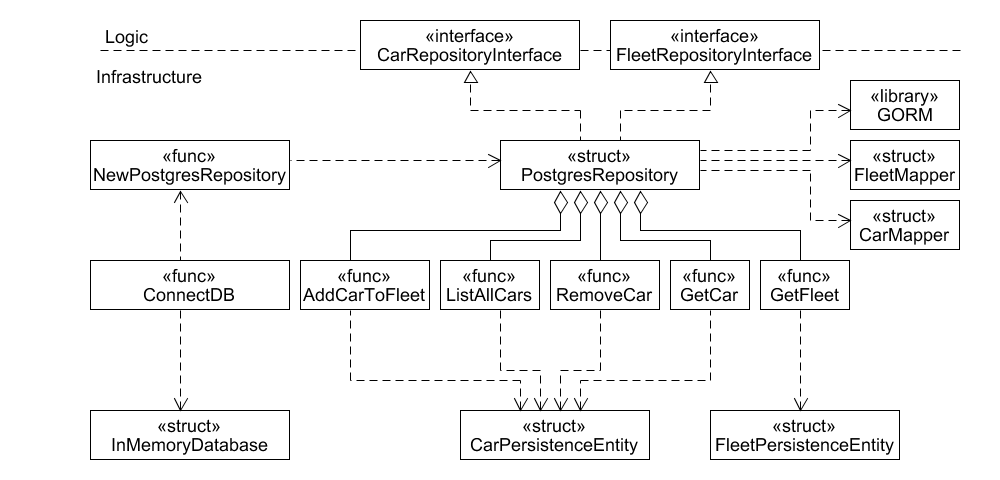

# Code Sketch Infrastructure AM-FleetManagementV1.0

This figure shows how the infrastructure of AM-FleetmanagementV1.0 is organized.

(«interface» CarRepositoryInterface) This interface defines the methods required to interact with cars in the database, such as adding, removing and retrieving information about particular cars.

(«interface» FleetRepositoryInterface) This interface defines the methods required to manage fleets.

(«struct» PostgresRepository) This structure implements the methods defined in the CarRepositoryInterface and FleetRepositoryInterface interfaces. It uses PostgreSQL as the underlying database to store and retrieve the data.

(«library» GORM) GORM stands for "Go Object-Relational Mapping" and is a library in the Go programming language that serves as an ORM tool. It helps to map Go structures to database tables and automates CRUD operations (Create, Read, Update, Delete) for the database.

(«struct» FleetMapper) Handles the conversion of fleet data between the application's internal structures and the database format.

(«struct» CarMapper) Manages the translation of car data between the application's structures and the database schema.

(«func» NewPostgresRepository) This function creates a new instance of the PostgresRepository. It configures the connection details and initializes the repository with everything necessary for its operation.

(«func» ConnectDB) This function establishes a connection to the database using the configuration information passed to the PostgresRepository.

(«struct» InMemoryDatabase) This structure represents an in-memory database. It is used for testing purposes or to simulate a database environment without the need for a real database connection.

(«func» AddCarToFleet) This function adds a new car to a fleet. It updates the fleet data in the database.

(«func» ListAllCars)  This function returns a list of all cars in a fleet. It is used to browse the complete collection of cars of a fleet.

(«func» RemoveCar) This function removes a car from a fleet in the database.

(«func» GetCar) This function retrieves a car object based on a given Vin.

(«func» GetFleet) This function retrieves a fleet based on a given fleetID.

(«struct» CarPersistenceEntity) Represents the data model for cars in the database, includes the Vin, Brand, Model, Location and fleetID.

(«struct» FleetPersistenceEntity) Represents the data model for fleets in the database, includes the FleetID, Location and FleetManager.
