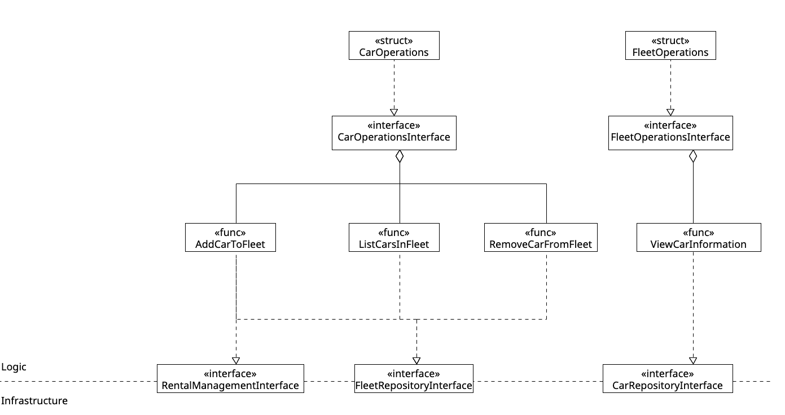

# Code Sketch Logic AM-FleetManagementV1.0

This figure models the structure of the logic section of AM-FleetmanagementV1.0.

(«interface» CarRepositoryInterface) This interface defines the methods required to interact with cars in the database, such as adding, removing and retrieving information about particular cars.

(«interface» FleetRepositoryInterface) This interface defines the methods required to manage fleets.

(«func» AddCarToFleet) This method adds a car to a fleet by employing the FleetRepository Interface to add the car to the fleet, and subsequently employing the RentalManagement Interface to make the car avaiailable as a rentable car.

(«func» ListCarsInFleet) This method uses the FleetRepository Interface to query all cars contained within a given fleet.

(«func» RemoveCarFromFleet) This method uses the FleetRepository Interface to remove a car form a given fleet.

(«func» ViewCarInformation) This method uses the CarRepository Interface to query the given car model using its VIN.

(«interface» FleetOperationsInterface) This interface defines the operations needed to add, remove and list cars in a given fleet.

(«interface» CarOperationsInterface) This interface defines the operations required to handle the car model.

(«struct» FleetOperations) Defines the repository as well as API's required for the fleet operations.

(«struct» CarOperations) Defines the repository as well as API's required for the car operations.

