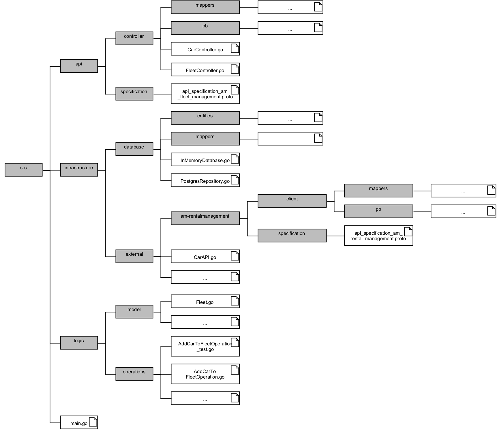

# Folder Structure AM-FleetManagementV1.0

This figure illustrates the general folder structure of the AM-FleetManagementV1.0 microservice in Golang.
The project is split into three main parts:
- /api: this is where the API endpoints are controlled
- /infrastructure: this is where the local database and connections to external microservices are handled
- /logic: this is where the functionality of the methods are set.
