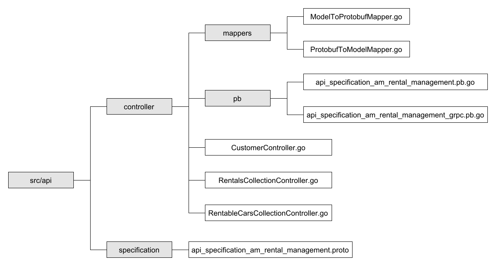
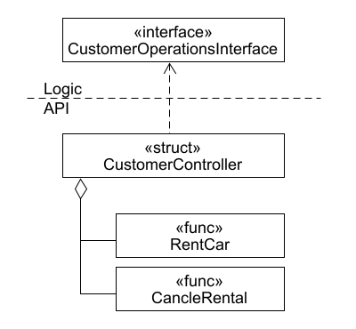
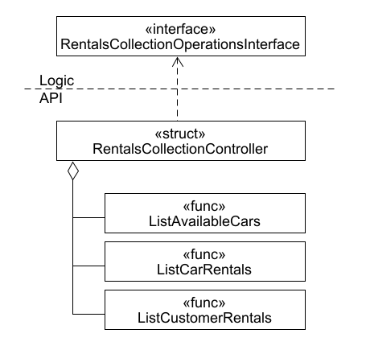
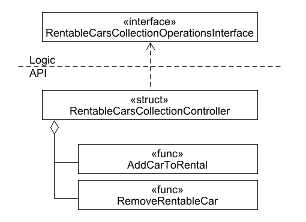

# Code Sketch AM-RentalManagementV2.0 API

The package api contains the controllers representing the services defined in the api specification,
two generated protobuf files containing functions and models to interact with gRPC clients, 
and mappers to convert between the protobuf entities and the models they represent. 
The Controllers are illustrated in the following figures and their descriptions.

## Customer Controller

The CustomerController uses the CustomerOperationsInterface to provided its functions:
RentCar, and CancelRental.

## Rentals Collection Controller

The RentalsCollectionController uses the RentalsCollectionOperationsInterface to provided its functions:
ListAvailableCars, ListCarRentals, and ListCustomerRentals.

## Rentable Cars Collection Controller

The RentableCarsCollectionController uses the RentableCarsCollectionOperationsInterface to provided its functions: 
AddCarToRental, and RemoveRentableCar.