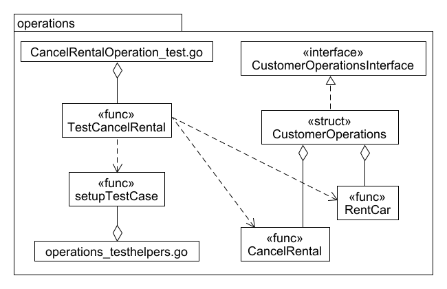

# Code Sketch CancelRentalOperation_test AM-RentalManagementV2.0

This code sketch is meant to illustrate the structure of the testing of AM-RentalManagementV2.0.

(«func» CancelRental) The function/operation tested here.

(«func» RentCar) This function is needed here, because in order to test if a rental was canceled correctly the rental must first be created.

(CancelRentalOperation_test.go) This is where the tests for CancelRentalOperation are located.

(«func» TestCancelRental) This is the test function where the actual testing takes place.

(operations_testhelpers.go) In this file testhelpers, meant to ease the writing of tests are located.

(«func» setupTestCase) Creates the environment for the test case.

(«interface» CustomerOperationsInterface) This interface provides the functions Rentcar and CancelRental.

(«struct» CustomerOperations) This struct implements the interface CustomerOperationsInterface.