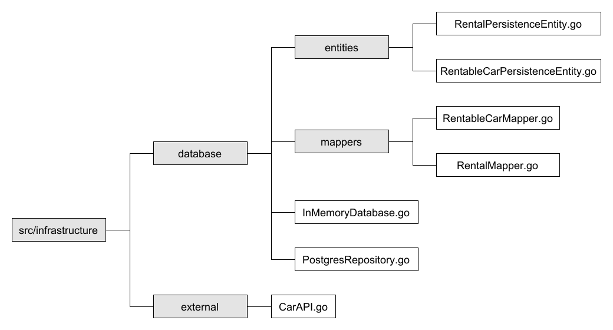
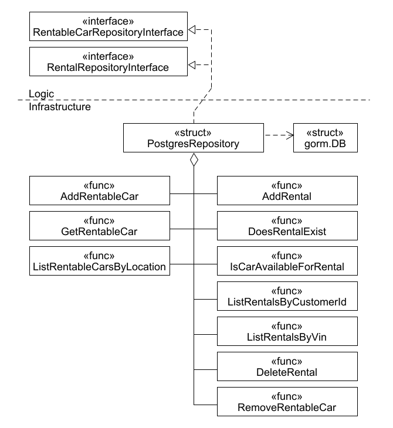
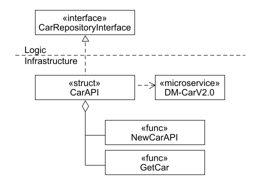

# Code Sketch AM-RentalManagementV2.0 Infrastructure

The package infrastructure contains the repositories, an in memory database defined by its entities, 
and mappers to convert between the persistence entities and the models they represent. 
The repositories are illustrated in the following figures and their descriptions.

## Postgres Repository

This code sketch illustrates the structure of the postgres repository.

(«interface» PostgresRepositoryInterface) This interface provides all the depicted functions.

(«struct» PostgresRepository) Here, the interface PostgresRepositoryInterface is implemented.

(«struct» gorm.DB) This is the database used for AM-RentalManagementV2.0.

## Car Repository

This code sketch illustrated the structure of the car repository.

(«interface» CarRepositoryInterface) This interface provides the functions NewCarAPI and GetCar.

(«struct» CarAPI) Here, the interface CarRepositoryInterface is implemented. 
This struct communicates with the domain microservice DM-CarV2.0 via API requests in order to implement its functionality.

(«microservice» DM-CarV2.0) DM-CarV2.0 is part of CarRentalAppV2.0.

(«func» GetCar) This function receives a VIN and returns the brand and model of the corresponding car.
