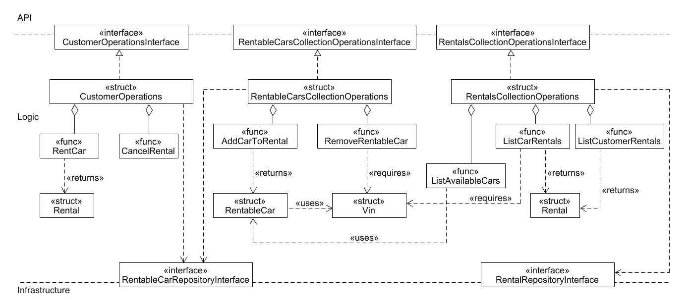

# Code Sketch AM-RentalManagementV2.0 Logic

(API) The interfaces CustomerOperationsInterface, RentableCarsCollectionInterface, and RentalsCollectionOperationsInterface from the API provide the business operations that needs to be implemented by the underlying structs.

(Logic) The logic part contains the structs and functions to fulfill the business logic such as adding rentable cars, renting cars, as well as listing rentals.
(«struct» CustomerOperations) Provides the necessary functions for renting a car and canceling rentals.
(«struct» Rentals) Returned by «func> RentCar as result if the rental process was successful.

(«struct» RentableCarCollectionOperations) Provides functions to add and remove rentable cars. A RentableCar is added with the «func» AddCarToRental.
(«struct» RentableCar) Defines which attributes a RentableCar has. For example, the attribute's location and PricePerDay. In addition, a RentableCar can be removed with «func»> RemoveRentableCar.
(«struct» Vin) Identifies a RentableCar and is required to remove a RentableCar.

(«interface RentableCarRepositoryInterface) Provides methods for the different car-related operations for storing and retrieving.

(«struct» RentalsCollectionOperations) Provides functions related to rentals such as listing available cars, and rentals belonging to a car.
(«struct» Rental) Returned by the functions ListCarRentals and ListCustomerRentals.

(«interface RentalRepositoryInterface) Provides methods for the different rental-related operations for storing and retrieving.

 
