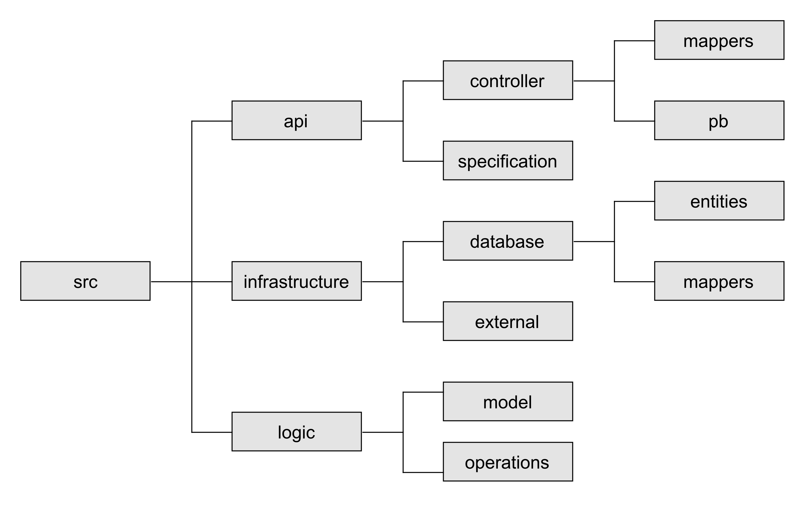

# Folder Structure AM-RentalManagementV2.0

This figure illustrates the folder structure of AM-RentalManagementV2.0.

The project is split into three main parts:
- /api: this is where the API endpoints are controlled and defined
- /infrastructure: this is where the local database and the connections to DM-CarV2.0 are handled
- /logic: this is where the operations and their models are implemented
