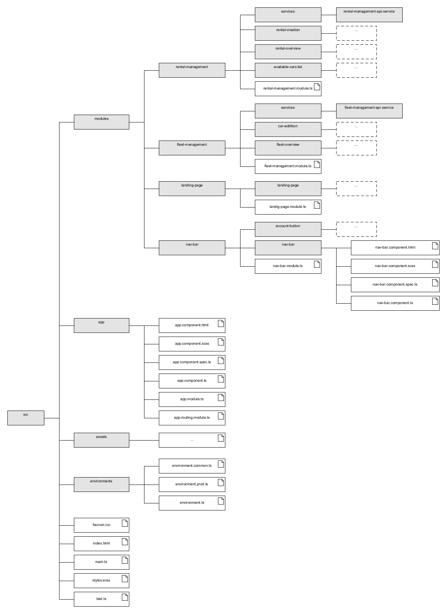

# Folder Structure UI-CarRentalAppV2.0

- **src**: Contains the source files of the angular procject.   
    - **modules**: Contains the angular modules which can be lazy-loaded. Each feature should be consided as a seperate module. Components, services, models and other functionality should be grouped to a module.
    - **core**: Contains the core angular modules which are loaded once at application start. E.g., root-scoped services, static components like the navbar, interceptors, guards, constants, enums, utils.
    - **assets**: Contains asset files (e.g., images) to be copied as-is when the application is build.
    - **app**: Contains the the app module. The app module is the entry point of the application. It is used to bootstrap the angular application.
    - **environments**: Contains environment settings for each deployment configuration.