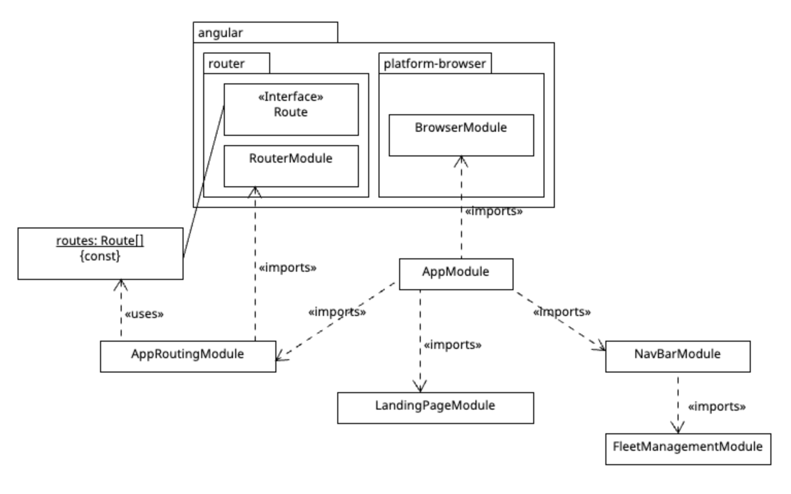

# Package Diagram UI-CarRentalV2.0

In the overview, all Angular modules and the relationships between these modules are modeled.

(angular) This package (including the sub-packages router and platform-browser) is an external package used in the Angular project.

(AppModule) This main module describes the resulting application.\
(AppRoutingModule, BrowserModule, LandingPageModule, NavBarModule) These are all the needed or created modules that are imported into the main module AppModule.

(RouterModule) Adds directives and providers for in-app navigation among views defined in an application.\
(\<<Interface\>> Route) A configuration object that defines a single route. A set of routes are collected in a Routes array to define a Router configuration.\
(routes: Route[] \{const\}) The Router configuration of UI-BestRentalV1.1 as an array of Routes.

(AppRoutingModule) This module is used for routing.

(BrowserModule) Exports required infrastructure for all Angular apps.

(LandingPageModule) Describes the landing page of the resulting website.

(NavBarModule) This module is responsible for the functionality of the navigation bar of the resulting website.
